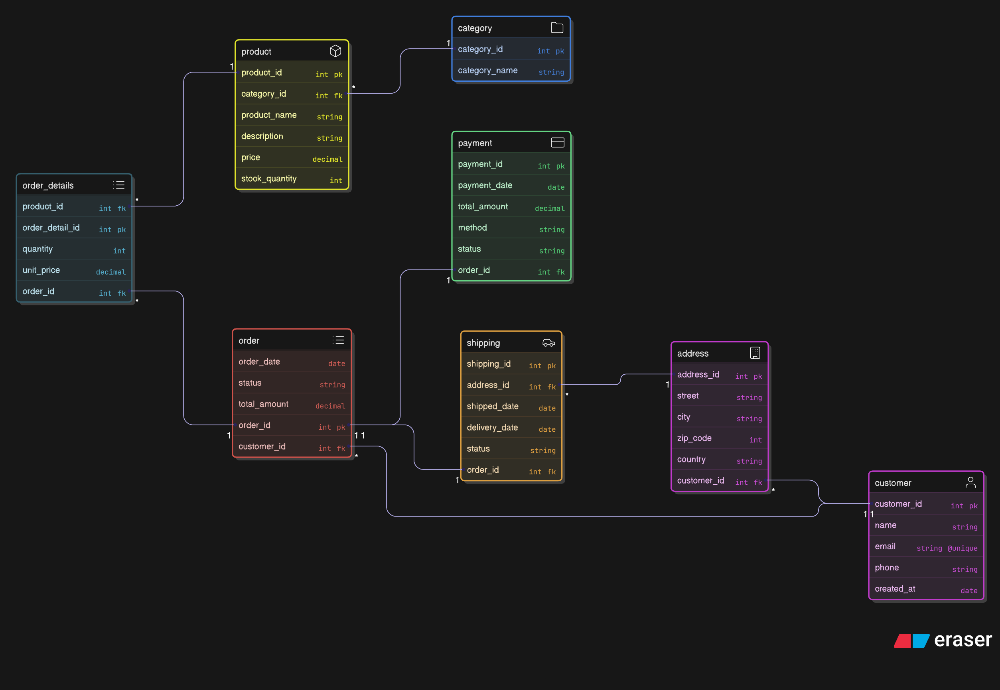
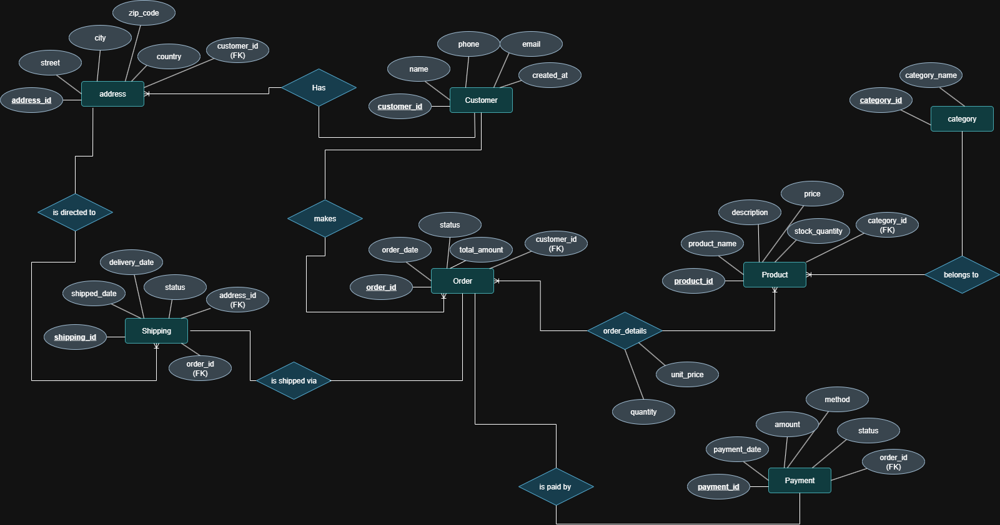

# 🛒 E-Commerce Database Project  

## 📌 Overview  
This project is a **PostgreSQL database** designed for an e-commerce system.  
It covers the essential database concepts including:  
- ERD & Schema design  
- Table creation with relationships & constraints  
- Queries (basic & advanced)  
- Functions, Procedures, and Triggers  
- Views & Materialized Views  
- Indexing & Performance Optimization  

---

## 🔧 Prerequisites  
- Install [PostgreSQL](https://www.postgresql.org/download/) (v14 or higher recommended).  
- Ensure `psql` command line tool is working.  

---

## 📦 Requirements  
- PostgreSQL server running locally (default port 5432).  
- Database user: `postgres` (or update commands if using another user).  

---

## ✨ Features  

- 🏗️ Full database schema (tables, constraints, relationships).  
- 📊 Sample queries for analytics and reporting.  
- ⚡ Indexing & query optimization.  
- 🔄 Stored functions & procedures for advanced logic.  
- 🔔 Triggers for automatic updates and validations.  
- 🐍 Python script to auto-generate random test data.  

---

## 🚀 How to Run  

Run these commands in **bash/command line** 

```bash
psql -U postgres -h localhost
CREATE DATABASE ecommerce
\c ecommerce 
\i run_all.sql
```
---

## 🐍 Data Generation

This project includes a Python script (data_generation_script.ipnyb) that automatically generates random data for testing.
It helps you quickly populate the database with customers, products, orders, and payments.

---

## 📊 Schema & ERD

You can find diagrams in the repository:

### Database Schema  
  

### Entity Relationship Diagram  
  

---

## 🎯 Purpose

This project was developed as a practice exercise for database engineering & SQL skills, including schema design, query writing, and performance optimization

---

## 🤝 Contributing

Feel free to fork this repo, open issues, or submit pull requests with improvements.

---

## 🌐 Connect with Me  

[](https://www.linkedin.com/in/ali-alaa/) 
[](https://github.com/Alialaa122)  

---

## 📜 License

This project is licensed under the MIT License.

---

